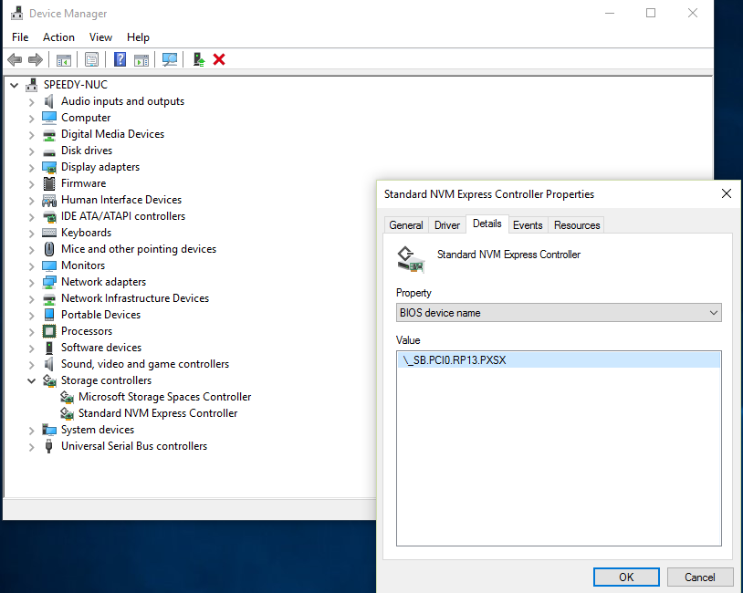
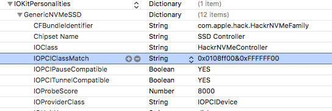
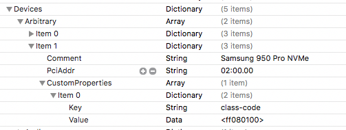

## 前言

> 这里讨论的配置是：XPS15-9550 i7-6700HQ HD530 8G-DDR4 1080P THNSN5256GPU7-NVMe-256G DW1830(无线网卡ac+蓝牙4.1LE)  Realtek ALC298 (codec:10EC0298,layout-id:13)

之前在论坛10.11版发过一篇教程，写得算是详细了，但是苦于论坛编辑器各种坑，内容总是不能完整 ([GitHub完整观摩地址](https://github.com/darkhandz/XPS15-9550-OSX))。所以这次写10.12.1的，就不打算长篇大论手把手什么的了，假设各位童鞋都是有经验的，关键的地方点到为止即可。

这次DSDT不再采取手动改错+加代码+打补丁的方式了，采用了[RehabMan教程提到的Clover热补丁技术](https://www.tonymacx86.com/threads/guide-using-clover-to-hotpatch-acpi.200137/)。理论上同机型的情况下有一定的通用性，具体情况如何我没有测试过，希望有童鞋成功后可以反馈一下。

假设真的如我上面所说，有一定的通用性的话，这次的操作应该是比较爽的，你只需要下载10.12.1的系统dmg，制作成安装盘，把我的Clover文件夹替换掉引导U盘的Clover文件夹，重启，安装，然后就安装各种第三方驱动，再把Clover做到硬盘引导，一切就完成了，切记不要再放你的DSDT.aml到ACPI/patched目录。

因为10.12确实太不靠谱了，所以不推荐使用，直奔10.12.1比较好。

完成的情况似乎和10.11.6没什么区别，但是不会再随机卡在开机Logo画面了（弃用了AppleALC，但还是感谢它的Binary Patches）。

USB3.1和Thunderbolt目前似乎还是没有什么好办法，等吧。

触摸板驱动还是很差劲，耐心等待吧，还好我都是用鼠标干活的……

## 各资源目录的作用

- `ALC298(3266)-Info`，声卡相关的节点，LayoutID，ConfigData信息，有需要可以自己拿来用
- `CLOVER-Install`，完整的Clover配置（你下载后自己把名字改回Clover），用于安装系统时，也可以用于安装后，差别是config.plist里去掉了安装系统时所需的nvme的patches
	- `SSDT.aml`不适合i5，请自行学习生成CPU变频的方法。
- `Clover-Finish`，安装完系统后的一些配置变化，只有config.plist稍有不同（去掉了NVMe的破解补丁），另外附上了10.12.1的nvme破解驱动（即打过binary patch后的）
- `DSDT-HotPatches`，Clover的DSDT/SSDT热补丁dsl源码，可以从[RehabMan主页](https://github.com/RehabMan/OS-X-Clover-Laptop-Config/tree/master/hotpatch)得到。
	- `SSDT-NVMe.dsl`不可以直接使用，请按下面NVMe教程处理过才用，或者干脆不用！
- `MoreKexts-LE`，安装好系统后再安装的第三方驱动。


## 开始

#### 1. 系统镜像

这个可以自行下载，找pcbeta论坛里10.12.1的DMG就行了

- 如果你已有硬盘EFI分区的Clover，那下载原版的DMG也可以
- 没有的话就要找带U盘Clover引导的镜像，这里随便无责任推一个：[10.12.1镜像](http://bbs.pcbeta.com/viewthread-1724225-1-1.html)，注意选用原版，不要下错懒人版了。

#### 2. 镜像写入U盘

还是老伙计，`Transmac`，网上找个和谐版吧，写入U盘的过程我不说了，参考我上一篇教程，写入完毕后：

- 如果你有硬盘Clover，把你EFI里的Clover文件夹改名成bak，用我的Clover文件夹代替。
- 如果你没有硬盘Clover，那就删除U盘EFI分区里面的Clover文件夹，用我的Clover文件夹代替。
	- 不知道如何设置BIOS让U盘的Clover引导启动的话，参照我上一篇教程的BIOS设置部分。
- 把我提供的MoreKext-LE复制到U盘安装系统的分区里（方便你安装系统后立刻可以访问）
- 如果你是4K屏，打开config.plist，在Devices节点下增加一个：

	```
	<key>FakeID</key>
	<dict>
	    <key>IntelGFX</key>
	    <string>0x12345678</string>
	</dict>
	```
- 如果你是i5，config.plist里的`0x191b0000`还要改成`0x19160000`。
- 如果你是i7+1080P，飘过。
- 忘了说，我Clover采用的是`3923`版本。

> 感谢 [@matri](https://github.com/matri)同学反映的4K分辨率问题，之前没留意写上来

#### 3. 安装系统

用Clover引导安装你写入了U盘的镜像系统，完成并进入系统

> 据[@shiweifu](https://github.com/shiweifu)同学的反映，引导时可能会遇到panic并瞬间重启，可尝试在config.plist的SMBIOS [注入内存信息](http://bbs.pcbeta.com/viewthread-1690183-1-1.html)

#### 4. 安装其他驱动

把我提供的MoreKext-LE复制到桌面，里面有**`LE`**和**`VoodooPSController`**文件夹  
执行终端命令：

- `cd 鼠标拖LE文件夹过来`
- `sudo cp -r * /Library/Extensions/`
- `sudo rm -rf /System/Library/Caches/com.apple.kext.caches/Startup/kernelcache`
- `sudo rm -rf /System/Library/PrelinkedKernels/prelinkedkernel`
- `sudo touch /System/Library/Extensions && sudo kextcache -u /`，
	- 正常情况执行的时候是会显示LE文件夹里那些驱动的名字，30秒左右完成。
	- 如果是提示`Lock acquired; proceeding`什么的，等到再次提示执行命令的时候重复执行一次上条命令即可。
- `sudo spctl --master-disable`，这个是让系统可以安装任何来源的APP

还有个VoodooPSController文件夹，里面有个文件`_install.command`，双击运行，输入密码，完成后关闭。


#### 5. 4K屏附加处理步骤（1080的自觉飘过吧）

- 终端执行这两条命令：
	
```
sudo perl -i.bak -pe 's|\xB8\x01\x00\x00\x00\xF6\xC1\x01\x0F\x85|\x33\xC0\x90\x90\x90\x90\x90\x90\x90\xE9|sg' /System/Library/Frameworks/IOKit.framework/Versions/Current/IOKit
sudo codesign -f -s - /System/Library/Frameworks/IOKit.framework/Versions/Current/IOKit
```
	
- 然后把config.plist的Devices下的FakeID整个删除（如果是用Clover Configurator配置，把IntelGFX框清空）。


#### 6. 给NVME驱动打补丁

> RehabMan大神在[NVME-patch的github主页](https://github.com/RehabMan/patch-nvme)强调过，用Clover给Kext驱动动态打补丁还是有点危险的（特指nvme驱动的情况下），如果你的OSX系统更新了，原生的NVME驱动随之更新，然后Clover打补丁的时候不一定能完全匹配到所有补丁（因为补丁是有版本针对性的），造成“部分补丁成功”的情况，糟糕的是，OSX系统还加载了这个半成品驱动……引发的后果是，你的磁盘数据可以会被损坏……  

所以，大神建议，一旦你过了安装系统的阶段，就应该给NVME驱动打个静态的补丁，生成一个kext驱动，安装到S/L/E或者L/E里，然后删除系统原生的NVME驱动（IONVMeFamily.kext）。

前因后果就这样了，下面的步骤之前，我觉得你应该能联网了（网卡如果和我的一样的话），下面的步骤需要网络支持。

- `cd ~/Downloads`
- `git clone https://github.com/RehabMan/patch-nvme.git`，如果提示你要安装命令行工具什么的，点击安装，大概等5～10分钟完成，然后再执行一次本条命令才继续下面的操作。
- `cd patch-nvme`
- `./patch_nvme.sh 10_12_1`
- `open .` 注意这条命令里有一个点，不是我手抖。然后你发现有个292KB的 **`HackrNVMeFamily-10_12_1.kext`** 文件

继续看回终端：

- `sudo cp -r HackrNVMeFamily-10_12_1.kext /Library/Extensions/`
- `sudo mv /System/Library/Extensions/IONVMeFamily.kext /System/Library/Extensions/NVME.bak`，这个意思是，把系统的NVME驱动改名，下次就不会加载了。接下来重建缓存：
- `sudo rm -rf /System/Library/Caches/com.apple.kext.caches/Startup/kernelcache`
- `sudo rm -rf /System/Library/PrelinkedKernels/prelinkedkernel`
- `sudo touch /System/Library/Extensions && sudo kextcache -u /`

如果一切顺利，你会在命令行看见列出了你安装过的IntelBacklight、NullEthernet、`HackrNVMeFamily-10_12_1`、aDummy.kext，否则等1分钟后再执行一次上述重建命令。

补丁打完了，现在要把EFI分区里Clover的config.plist里面的所有关于IONVMeFamily的补丁删除，请自行用Clover Configurator挂载分区并操作。实在懒的话，可以用我GitHub的Clover-Finish文件夹里的plist覆盖你的。

#### 7. 假网卡

- 点击右上角的WiFi图标，选择最后一项，在左边列表删除掉所有网络。
- 终端执行`sudo rm /Library/Preferences/SystemConfiguration/NetworkInterfaces.plist`
- 系统偏好设置——Language & Region，添加简体中文，Restart now（重启）。
- 等系统重启完了，点击右上角的WiFi图标，选择最后一项，按顺序重新添加**以太网**，**Wi-Fi**，应用。蓝牙可以不添加，之后自动会加的。


## 结束

既然说了是点到为止，那就到此为止好了，本来怕有同学是U盘引导的，还想说说如何把Clover安装到硬盘，不过我上一篇教程里都有提过了，实在是不该再重复劳动了。

我总是有一种怕别人看不懂我文章，或者怕读者遇到和我文章描述的情况不同的时候该怎么办，后来想想，大概这是一种病了，哪里担心得了那么多呢，你会遇到的问题，几乎都有人遇到过，多搜索，然后再发帖提问吧。

完美黑苹果的路还很远，大家一起努力！

## 题外 - NVMe驱动，破解与原生的共存
> 考虑下如果系统在线升级了，原生IONVMeFamily.kext又被装回来了的情况下可怎么办？这里翻译一篇RehabMan的教程，让破解驱动与原生驱动共存。有动手能力的可以试试，我？当然是试过了才发出来的嘛……

如RehabMan在[patch-nvme的repo](https://github.com/RehabMan/patch-nvme)简介说过的，如果他找到了更好的方案，他会更新上来，刚好中午休息我看见了，于是就根据原贴来一个翻译吧，[原贴](http://www.insanelymac.com/forum/topic/312803-patch-for-using-nvme-under-macos-sierra-is-ready/page-29#entry2322636)。

- 下文提到的原生NVMe驱动指：IONVMeFamily.kext
- 破解脚本生成的NVMe驱动指：HackrNVMeFamily*.kext

---

这个方法的原理是伪造一个不存在于原生驱动的IOPCIClassMatch取值范围内的class-code来让其不加载。

- 分两步实现：
	1. 注入一个“非常规”的class-code使得原生NVMe驱动不加载
	2. 修改HackrNVMeFamily*.kext的Info.plist里的IOPCIClassMatch的值

要注入一个伪造的`class-code`，我选择用ACPI的方式（用一个SSDT）。前提是你必须知道你的SSD在PCI0设备的路径是什么。

在我的`NUC6i7KYK`机子里，路径是`_SB.PCI0.RP13.PXSX`，这个每台电脑都不一定相同的，和你的ACPI表、SSD插在哪个槽都有关，你可以用 **ioreg** 或者 **Windows设备管理器** 来确定，如下图。


因此，用于注入非常规`class-code`的SSDT代码如下：

	// Inject bogus class code for NVMe SSD so that native IONVMeFamily.kext does not load
	DefinitionBlock("", "SSDT", 2, "hack", "NVMe-Pcc", 0)
	{
	    External(_SB.PCI0.RP13.PXSX, DeviceObj)
	    Method(_SB.PCI0.RP13.PXSX._DSM, 4)
	    {
	        If (!Arg2) { Return (Buffer() { 0x03 } ) }
	        Return(Package()
	        {
	            "class-code", Buffer() { 0xff, 0x08, 0x01, 0x00 },
	        })
	    }
	}
	//EOF

在这个SSDT被加载之后，HackrNVMeFamily*.kext（破解脚本生成的驱动）和 原生NVMe驱动 **都不会加载了**，因为IOPCIClassMatch的值不匹配。

我们需要修改HackrNVMeFamily*.kext的IOPCIClassMatch的值为我们的非常规class-code：`0x0108ff00&0xFFFFFF00`。

- 如果你是用文本编辑器改plist的话，改成这样：

		<key>IOPCIClassMatch</key>
		<string>0x0108ff00&amp;0xFFFFFF00</string>

- 高端点，用Xcode改的话：

	

你可以把这种方法用于引导安装OSX或者用于安装好系统之后，它可以让你在系统升级之后依然能够使用HackrNVMeFamily*.kext来驱动，直到你想为新的原生NVMe驱动打破解补丁为止。

当然也可以用`config.plist/Devices/Arbitrary`来注入伪造的class-code。
在Clover的引导画面，你可以按F2键来得到preboot.log（生成在EFI/Clover/misc/preboot.log），它可以帮你确定PCI设备的地址。
	
	0:100  0:000  === [ GetDevices ] ========================================
	0:100  0:000  PCI (00|00:00.00) : 8086 1910 class=060000
	0:100  0:000  PCI (00|00:02.00) : 8086 193B class=030000
	0:100  0:000   - GFX: Model=Intel Iris Graphics P580 (Intel)
	0:100  0:000  PCI (00|00:08.00) : 8086 1911 class=088000
	0:100  0:000  PCI (00|00:14.00) : 8086 A12F class=0C0330
	0:100  0:000  PCI (00|00:14.02) : 8086 A131 class=118000
	0:100  0:000  PCI (00|00:16.00) : 8086 A13A class=078000
	0:100  0:000  PCI (00|00:1D.00) : 8086 A118 class=060400
	0:100  0:000  PCI (00|01:00.00) : 144D A801 class=010601
	0:100  0:000  PCI (00|00:1D.04) : 8086 A11C class=060400
	0:100  0:000  PCI (00|02:00.00) : 144D A802 class=010802
	0:100  0:000  PCI (00|00:1F.00) : 8086 A14E class=060100
	0:100  0:000  PCI (00|00:1F.02) : 8086 A121 class=058000
	0:100  0:000  PCI (00|00:1F.03) : 8086 A170 class=040300
	0:100  0:000  PCI (00|00:1F.04) : 8086 A123 class=0C0500
	0:100  0:000  PCI (00|00:1F.06) : 8086 15B7 class=020000

你可以看到950 Pro NVMe在PCI地址：02:00.00（设备：144d:a802，注意常规的NVMe class是：010802）

因此，在`Devices/Arbitrary`里这样填：
	

可别忘了，当你启用了Devices/Arbitrary，**所有Clover自动化注入的行为都会被取消掉**（例如Graphics/Inject里的内容），因此，那些自动注入项都要你自己手动在Devices/Arbitrary或者ACPI再注入一次。

---

好了，翻译完了，说说我是怎么做的。

1. 用**ioreg**找到自己的NVMe SSD所在的PCI位置路径，我的是`_SB.PCI0.RP09.PXSX`。

2. 用RehabMan的脚本生成破解的HackrNVMeFamily*.kext驱动，修改Info.plist，我用`PlistEditPro`改的，把IOPCIClassMatch改成：`0x0108ff00&0xFFFFFF00`，然后安装到/Library/Extensions里，把原生NVMe驱动（上面被我们改成了NVME.bak）改名回IONVMeFamily.kext。清除缓存。

3. 用上面提供的SSDT代码生成一个`SSDT-NVMe.aml`，放到ACPI/patched里加载，重启。重启完一切正常，在系统信息里查看IONVMeFamily.kext是**没有载入**的，签名是**Apple**的。

4. 有系统升级时照常升级，等新版本的NVMe破解脚本出来后再执行一次第2步，懒的话也可以什么也不做。（现在是10.12.1了，还没有新版让我测试直接升级）


## 特别鸣谢

- [RehabMan](https://github.com/RehabMan)
- [syscl](https://github.com/syscl)